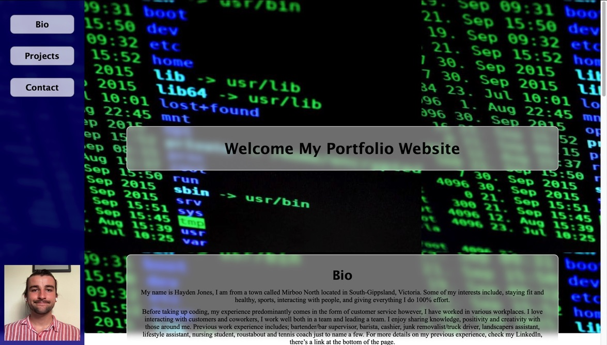

<header align="center"> 
  <h1> 👓 My Portfolio Website 👓 </h1> 
</header>

    

# User-Story
As a potential employer I want to have access to a website displaying Hayden's ability.

  # Table of contents
  * [User-Story](#user-Story)
  * [Description](#Description)
  * [Screenshots](#Screenshots)
  * [Installations](#installations)
  * [Usage](#usage)
  * [License](#license)
  * [Contributing](#Contributing)
  * [Testing-Procedure](#Testing-Procedure)
  * [Contact](#contact)
    

# Description
A basic front end html website that displays my knowledge and skills.
  
To visit the deployed version of my portfolio follow the link: 
https://hayden-jones-portfolio.herokuapp.com/

# Screenshots

# Installations
N/A

# Usage
Getting a job.

# Contributing
Please contact me if you have input on potential improvements that could be made to the project.

# Testing-Procedure
N/A

  # Contact
  If you would like to reach me in regards to either questions or comments, I am more than 
  happy to respond via github [Hayden-code](https://github.com/Hayden-code) or email [haychjones@gmail.com](haychjones@gmail.com).
    